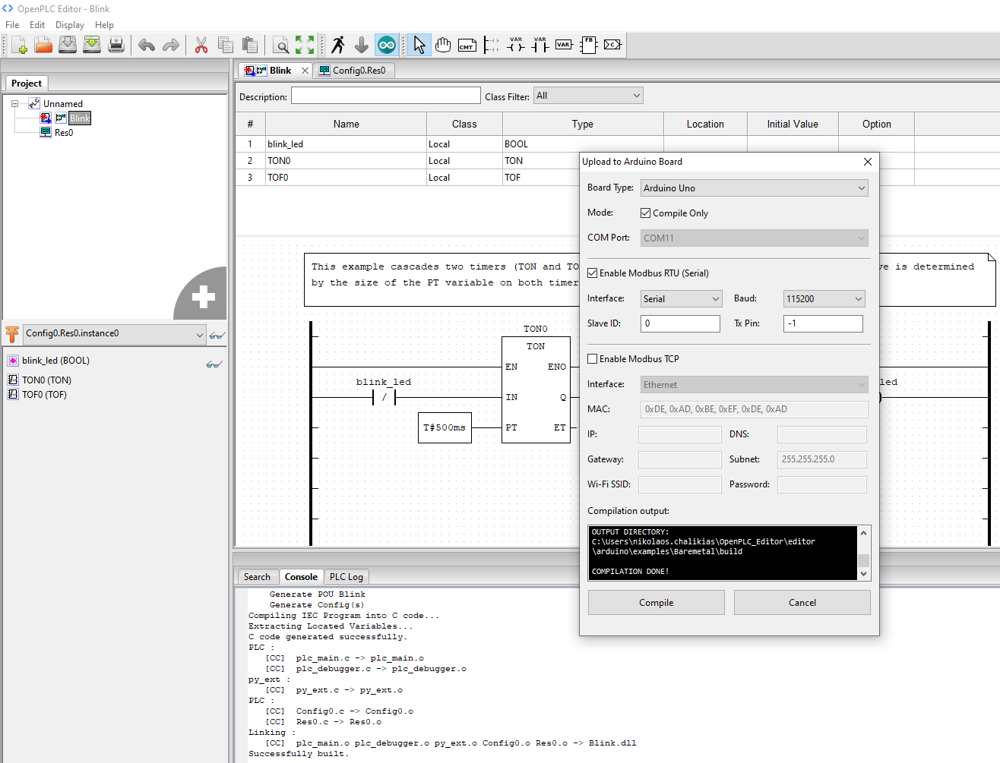
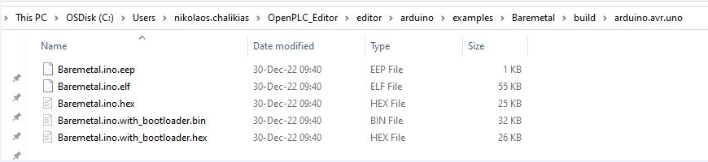
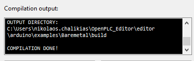

 
 

* [log](log.md)

# openPLC review

This is my review, testing and evaluation for openPLC running on microcontroller boards and on a Raspberry-Pi

----

`image 01: openPLC editor running in Windows10, compiled blink for Arduino UNO`

----

`image 02: Compilation Binaries`

----

`image 03: Compilation Binaries are overriding previous compilations`

----

## Links

* [Link 1: Elektor book: PLC Programming with the Raspberry Pi and the OpenPLC Project](https://www.elektor.com/plc-programming-with-the-raspberry-pi-and-the-openplc-project)

* [Link 2: Blog-page: OpenPLC on a Raspberry Pi](https://funprojects.blog/2021/11/18/openplc-on-a-raspberry-pi/)

* [Link 3: Elektor article: How to Use your Raspberry Pi as a PLC](https://www.elektormagazine.com/news/plc-with-raspberry-pi)

* [Link 4: Elektor book on Amazon UK](https://www.amazon.co.uk/dp/3895764698/?coliid=I2LVZFD7E02K2V&colid=1II7O5H31KI7Z&psc=1&ref_=_sed_dp)

